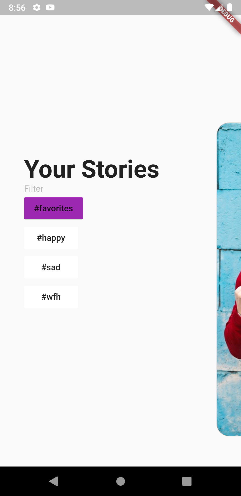
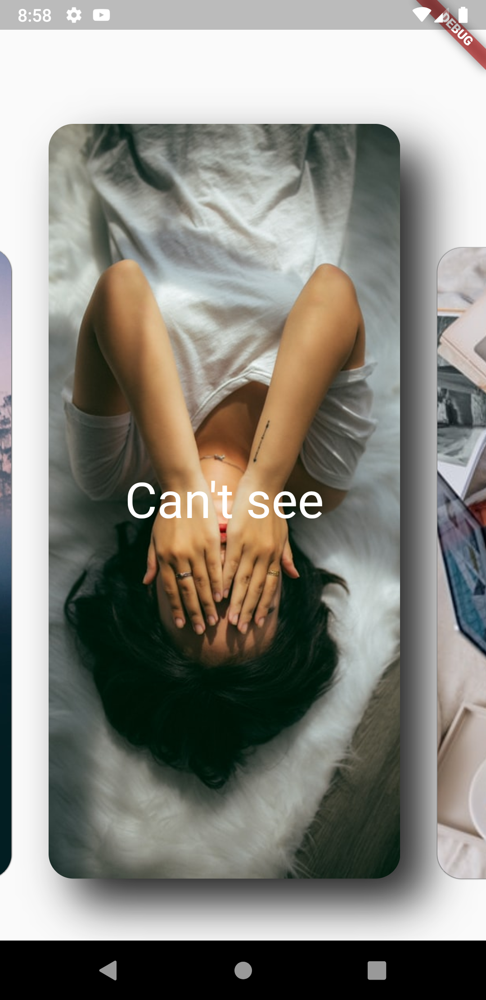
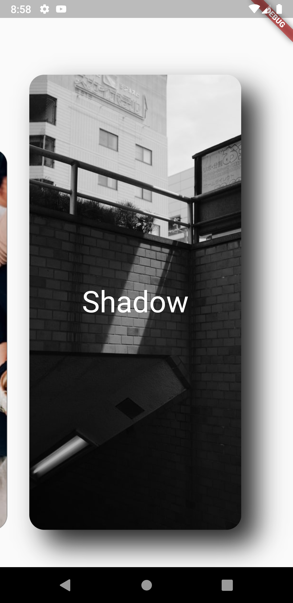

# wally

This is an app which displays image using the firebase database.

# Screenshots

  
   
  

## Get Sarted

1) Clone the repository.
2) Run "flutter pub get"
3) Run "flutter run"

## About

This project uses Flutter x Firebase.

# Inspiration

This app is inspired by Reflectly.

Reflectly App: [Refectly](reflectly.app)

# Reference
[Fireship](https://fireship.io/lessons/flutter-slider-like-reflectly/)
